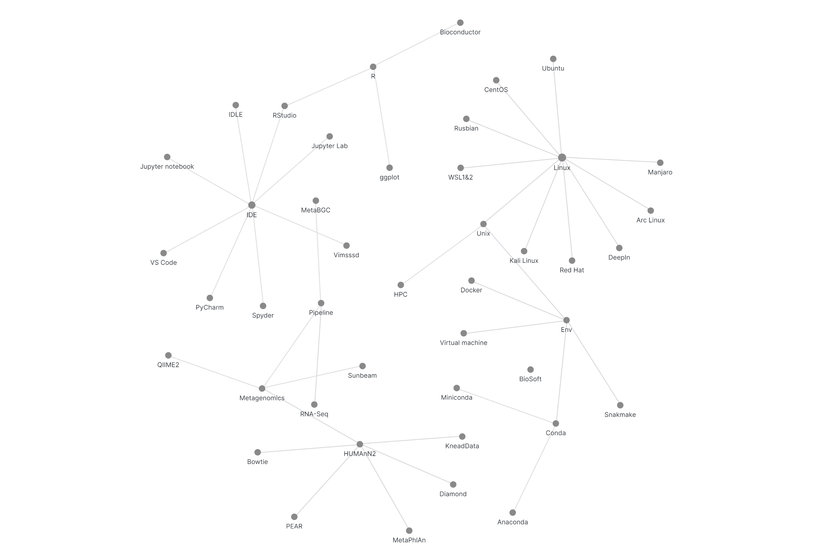

# Obsidian2Flourish
Convert Obsidian graph view to Flourish online preview
## Usage
python ./Obsidian2Flourish.py Obsidian_Vault_Dir

Then you will get tow `.csv` files in your current directory, They are:   
- `Links.csv`
- `Points.csv`

Simply import them into Network graph in [Flourish](https://app.flourish.studio), then you will get an interactive version that can embed on your website.

## Demo:
Obsidian's Graph View:

Interactive version in Flourish:

<iframe src='https://flo.uri.sh/visualisation/3581235/embed' frameborder='0' scrolling='no' style='width:100%;height:600px;' aria-label=''></iframe>

